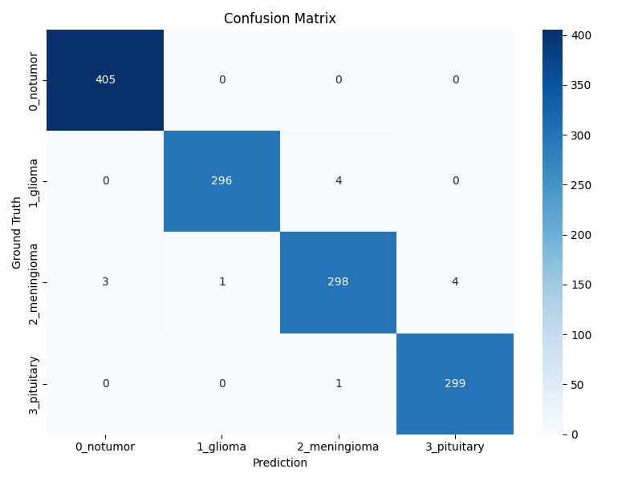

# Brain Tumor Classification

This project provides a brain tumor image classification model trained on ResNet-18 and integrates FastAPI and Streamlit to offer both programmable and graphical prediction services. It supports classification of four types of brain tumors:

- No Tumor
- Glioma 
- Meningioma
- Pituitary

---

## Quick Start 
### 1. Install Docker & Docker Compose

Make sure you have [Docker Desktop](<https://docs.docker.com/get-started/get-docker/> "Title") installed (with Compose support).

### 2. Launch Services

```
docker-compose up --build
```

### 3. Access the System

Streamlit UI: http://localhost:8501

---

## Dataset
### Source
The dataset is provided by Masoud Nickparvar on Kaggle:[Brain Tumor MRI Dataset](<https://www.kaggle.com/datasets/masoudnickparvar/brain-tumor-mri-dataset> "Title"). It includes four categories of brain MRI images: No Tumor, Glioma, Meningioma, and Pituitary. The image counts per category are:


<div align="center">

 No Tumor|Glioma|Meningioma|Pituitary
 :------:|:------:|:------:|:------:
 2000|1621|1645|1757

</div>

### Dataset for Training
The dataset was split into training, validation, and testing sets based on project needs. The distribution of the four categories across each set is shown below:
<div align="center">

 Categories   | Training  |  Validation | Testing
 :-------|:-------:|:-------:|:-------:
 No Tumor  |    1435    |  160   |  405
 Glioma    |    1189    |  132   |  300
 Meningioma|    1205    |  134   |  306
 Pituitary |    1311    |  146   |  300

</div>

---

## Model
### Architecture
We use ResNet-18 as the backbone model and replace the final classification layer to fit the brain tumor classification task. The trained weights are saved in models/resnet_best.pth.

### Evaluation 
The model is evaluated on the test set using standard metrics including precision, recall, and F1-score. A confusion matrix is also used to visualize performance.

#### Precisio, Recall & F1-score

<div align="center">

 Categories   | precision  |  recall | f1-score
 :-------|:-------:|:-------:|:-------:
 No Tumor  |     1.00   |  1.00   |  1.00
 Glioma    |    0.99    |  0.98   |  0.99
 Meningioma|  0.98      |  0.98   |  0.98
 Pituitary |    0.99    |  0.99   |  0.99

</div>

#### Confusion Metrix


---

## Notes
- If deploying in a public environment, please use HTTPS and authentication.

- This model is for research purposes only and not for clinical medical use.

## Contact
If you have any questions or suggestions, feel free to submit an Issue or a Pull Request!